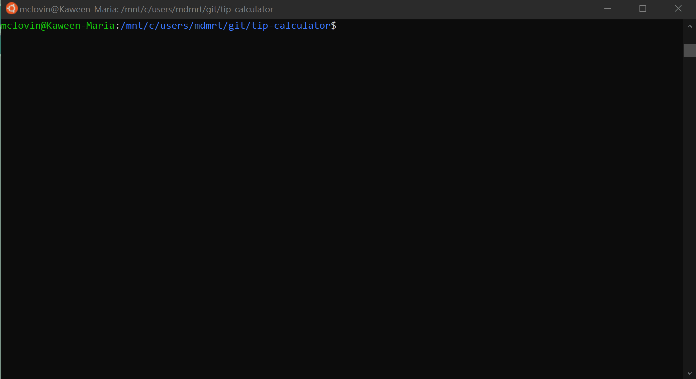

# Tip Calculator

Tip Calculator is a simple calculator created in python
- program calculates the total amount 
    - tip per person
    - total amount per person
## Run

```bash
python3 main.py
```
## Video Walkthrough


GIF created with [LiceCap](http://www.cockos.com/licecap/)